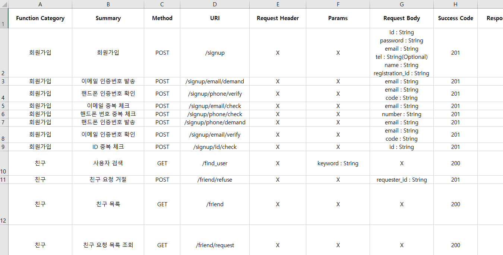

# Vert.x_Web-Server-Quickstart
Vert.x Web 서버를 만들 때 쓸 퀵스타트

## 주의사항
### config.properties
프로젝트 디렉토리에 config.properties 파일이 존재합니다. 서버의 구동을 위한 정보들이 담기는 파일이므로, 필요에 따라 값들을 채우기 바랍니다. Maven 빌드 후 원격으로 서버를 열 경우 .jar 파일이 있는 디렉토리에 config.properties 파일을 붙여넣어 주시기 바랍니다.

	// Port which server is run
	serverPort=80

	// AES Encryption Key
	aesKey=key

	// DataBase Table Name
	dbTableName=tableName

	// DataBase User Name
	dbUserName=root

	// DataBase Port : default is 3306
	dbPort=3306

	// DataBase Password
	dbPassword=password

	// SMTP Host
	smtpHost=host

	// SMTP id
	smtpId=id

	// SMTP password
	smtpPw=password

	// SMTP port
	smtpPort=587

	// Firebase server key
	fbServerKey=key

## 장점
### 쉬운 라우팅을 위한 어노테이션
별다른 조작 없이 바로 RESTful API 서버의 기능 구현에 집중하기 위해서 Route 어노테이션을 통해 구현하고자 하는 기능의 HTTP 메소드와 URI를 메타데이터로서 표현할 수 있습니다. 서버가 실행되면 Route 어노테이션이 선언된 클래스들을 자동으로 라우팅합니다.
##### com.planb.restful.Sample 클래스 참고

	@Route(uri = "/index", method = HttpMethod.GET)
	public class Index implements Handler<RoutingContext> {
		@Override
		public void handle(RoutingContext ctx) {
			...
			ctx.response().setStatusCode(200).end();
			ctx.response().close();
		}
	}
### REST API 문서화 어노테이션 : @API, @REST
Route 어노테이션이 선언된 클래스에 API와 REST 어노테이션을 선언해두면 서버가 실행될 때마다 서버의 API 문서를 엑셀 파일로 자동 생성합니다.

	@API(functionCategory = "인덱스", summary = "인덱스 라우터")
	@REST(responseBody = "index.html", successCode = 200)
	@Route(uri = "/index", method = HttpMethod.GET)
	public class Index implements Handler<RoutingContext> {
		@Override
		public void handler(RoutingContext ctx) {
			...
		}
	}
아래는 Quickstart를 실제로 적용하여 REST API 서버를 구축한 이후 자동으로 문서화된 엑셀 파일입니다.

### 구현되어 있는 데이터베이스와 암호화, Firebase 등의 유틸리티 클래스
utilities 패키지에 구현되어 있는 클래스들을 통해 쿼리문 조작, 로깅, 세션과 쿠키를 쉽게 다룰 수 있습니다.
### Maven 기반 프로젝트
Quickstart의 구성을 위해 사용된 라이브러리는 Maven으로 의존성 관리를 하기 때문에 기본 상태에선 라이브러리 추가에 시간 낭비를 하지 않아도 됩니다.
새로운 라이브러리(dependency)는 즉시 POM에 추가하여 프로젝트를 진행할 수 있습니다.

## 패키지 구조
	> main
	> restful
	> support.crypto
	> support.routing
	> support.utilities
	> additional
	> additional.networking_library
	
### > com.planb.main
#### Main.java
main 메소드가 위치하며, Vert.x 객체와 Verticle 배치 구문이 존재합니다.
#### MainVerticle.java
main 메소드에서 분기, Router 객체에 Body, Cookie, Session, Static 핸들러, com.planb.restful 패키지 하위의 RESTful 핸들러 클래스들을 배치한 이후 80번 포트로 서버를 시작시킵니다.

### > com.planb.restful
RESTful 핸들러 클래스들을 위치시킬 패키지
#### Sample.java
퀵스타트의 코딩 스타일을 적용하여 /test URI에 매핑된 클래스입니다.

### > com.planb.support.crypto
암호화 클래스들이 모인 패키지
#### AES256.java
AES256 암호화 클래스입니다. encrypt(String str)와 decrypt(String str) 메소드를 통해 암/복호화를 할 수 있습니다.
#### SHA256.java
SHA256 암호화 클래스. encrypt(String str) 메소드로 단방향 암호화를 할 수 있습니다.

### > com.planb.support.routing
커스텀 어노테이션들이 선언되어 있으며, 리플렉션을 통해 라우팅과 문서화를 진행하는 패키지
#### Document.java
RESTResource 타입의 List 객체를 생성자로 받아 엑셀 파일을 제작하는 클래스입니다.
#### RESTResource
REST 리소스가 정의되는 Value Object입니다. API 문서화를 위해 사용됩니다.
#### Route.java
String uri, HttpMethod method 필드를 가진 커스텀 어노테이션. Route 어노테이션이 붙어있지 않은 클래스는 라우팅에서 제외됩니다.
#### API.java (Optional)
클래스가 API로서 어떤 기능을 가지는지를 명시합니다.

	@API(name = “로그아웃”, summary = “쿠키 또는 세션 삭제”)
#### REST.java(Optional)
리소스에 대한 추가 정보를 명시합니다.

	@REST(requestBody = “id : String, password : String”, successCode = 201, failureCode = 204)
#### Routing.java
Router 객체와 가변 인자의 패키지 네임을 받아서 Route 어노테이션이 선언된 클래스들을 라우팅합니다. 추가적으로 API와 REST 어노테이션이 선언되어 있다면 엑셀 파일의 새로운 행에 기능을 문서화합니다.

### > com.planb.support.utilities
유틸리티성 클래스들이 모인 패키지
#### Config.java
config.properties에 접근하여 설정 정보를 읽습니다.
#### DataBase.java
MySQL에 연결되어 쿼리를 수행합니다.
MySQL은 기본적으로 8시간동안 요청이 없으면 커넥션을 해지합니다. 이를 해결하기 위해 static 블록에 6시간마다 'SELECT 1' 쿼리문을 수행하는 스레드를 등록해 두었습니다. 타임아웃에 관한 문제를 따로 해결했다면, 자원 낭비를 막기 위해 이 스레드를 지워주세요.
#### Log.java
logs 디렉토리 하위에 서버의 작동 날짜로 이루어진 파일에 로그를 남깁니다.
#### SessionUtil.java
세션과 쿠키를 다루기 위한 클래스입니다.
#### CORSHandler.java
자바스크립트 AJAX 요청 시 CORS Header를 얹어주는 일을 하는 Handler입니다.

### > com.planb.additional
서버 구성 시 추가적으로 사용할만한 클래스들이 모인 패키지
#### Firebase.java
Firebase 3rd-party 서버 구현을 돕기 위한 클래스입니다. Registration ID를 이용한 푸쉬 알림, topic 기반 푸쉬 알림이 구현되어 있습니다.
#### Mail.java
SMTP를 이용해 메일 전송을 하기 위한 클래스입니다.
### > com.planb.additional.networking_library
##### Simple-Networking-Library
<https://github.com/JoMingyu/Simple-Networking-Library>

